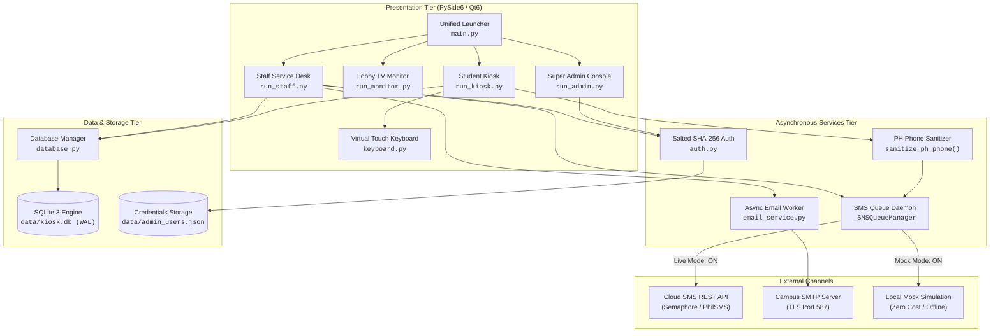

<div align="center">

# 🎓 TapNQue — Campus Queue Management System
### *Enterprise Multi-Station Student Ticketing & Real-Time Queue Orchestration Engine*

[](https://www.python.org/)
[-41CD52?style=for-the-badge&logo=qt&logoColor=white)](https://doc.qt.io/qtforpython/)
[-003B57?style=for-the-badge&logo=sqlite&logoColor=white)](https://www.sqlite.org/)
[](https://docs.pytest.org/)
[](https://microsoft.com/windows)
[](LICENSE)

<br/>

[Key Features](#-key-features) •
[System Architecture](#-system-architecture) •
[Station Topology](#-station-topology) •
[Quickstart](#-quickstart-guide) •
[SMS Engine](#-sms-notification-subsystem) •
[Security](#-authentication--security) •
[Documentation](#-comprehensive-documentation-index)

</div>

---

## 🌟 Overview

**TapNQue** (v2.1.0-PROD) is a robust, decoupled desktop queue management and student ticketing solution built specifically for university environments (configured for **Our Lady of Fatima University – OLFU**). Built with **Python 3** and **PySide6 (Qt for Python)**, TapNQue coordinates student self-service kiosks, public waiting area TV displays, counter service desks, and executive supervisory consoles across a concurrent, thread-safe SQLite database operating in **Write-Ahead Logging (WAL)** mode.

---

## ⚡ Key Features

<table>
  <tr>
    <td width="50%">
      <h3>🎟️ Student Touchscreen Kiosk</h3>
      <ul>
        <li>Self-service check-in with animated 3-step diagnostic splash.</li>
        <li>Dynamic on-screen touch keyboard (QWERTY & Numeric).</li>
        <li>Automated Student Number formatting (<code>YYYY-NNNNN</code>).</li>
        <li>Philippine mobile number sanitization (<code>09XXXXXXXXX</code>).</li>
        <li>Priority tagging (Urgent, PWD, Parent/Guardian, Student).</li>
        <li>Instant on-screen digital receipt with 8s auto-reset.</li>
      </ul>
    </td>
    <td width="50%">
      <h3>📺 Public TV Waiting Display</h3>
      <ul>
        <li>Fullscreen high-contrast TV lobby display (<code>F11</code> toggle).</li>
        <li>"Now Serving" live cards with pulsating visual call flash.</li>
        <li>Upcoming waiting queue preview (Up Next 1–6).</li>
        <li>Real-time counter status and average wait estimations.</li>
        <li>Audible call chime support (<code>assets/audio/notify.wav</code>).</li>
        <li>Automatic polling every 2,000ms with zero UI flicker.</li>
      </ul>
    </td>
  </tr>
  <tr>
    <td width="50%">
      <h3>💼 Counter Staff Service Desk</h3>
      <ul>
        <li>Role-based modal authentication (Salted SHA-256).</li>
        <li>Dynamic counter station switching (Counters 1 through 4).</li>
        <li>Real-time prioritized FIFO waiting list.</li>
        <li>One-click actions: <b>Call Next</b>, <b>Recall</b>, and <b>Mark Done</b>.</li>
        <li>Automated background SMS and Email dispatches.</li>
        <li>Modal service history of the last 30 transactions.</li>
      </ul>
    </td>
    <td width="50%">
      <h3>🔧 Super Admin Executive Console</h3>
      <ul>
        <li>Operations dashboard with real-time queue health heuristics.</li>
        <li>Consolidated live queue monitor across all counters.</li>
        <li>Scrollable Settings: Kiosk field visibility & master SMS toggles.</li>
        <li>Live ↔ Capstone Mock Mode switcher for defense presentations.</li>
        <li>In-memory session Mock SMS log viewer (last 100 events).</li>
        <li>Database maintenance: export JSON, purge completed tickets.</li>
      </ul>
    </td>
  </tr>
</table>

---

## 🏗️ System Architecture

TapNQue utilizes a decoupled multi-process architecture where stations can run on a single workstation or distributed across dedicated hardware (touchscreen tablets, counter PCs, lobby HDMI TVs) communicating concurrently over local SQLite WAL storage:



---

## 📁 Repository Structure

```
Project6/
├── assets/                          # Media & university identity assets
│   ├── audio/                       # Notification sound specs (NOTIFY_SOUND.md)
│   └── images/                      # Official OLFU university logos & backgrounds
├── data/                            # Persistent operational storage
│   ├── admin_users.json             # Salted SHA-256 hashed credentials
│   ├── kiosk.db                     # Primary SQLite database (WAL Mode)
│   └── queue_db.json                # Legacy JSON storage archive
├── docs/                            # System guides & operational manuals (DD-MM-YYYY)
│   ├── 09-09-2026_TapNQue_Windows_Setup_and_Run_Guide.docx
│   ├── 11-09-2026_TapNQue_Comprehensive_System_Guide_and_Semaphore_Manual.docx
│   └── 11-09-2026_TapNQue_Comprehensive_System_Guide_and_Semaphore_Manual.md
├── src/                             # Python source package (PEP 518/621)
│   └── tapnque/
│       ├── __init__.py
│       ├── __main__.py              # python -m tapnque entrypoint
│       ├── config.py                # Centralized paths & environment overrides
│       ├── core/                    # Persistence & authentication
│       │   ├── auth.py              # Salted cryptographic auth & dialog
│       │   └── database.py          # SQLite interface with WAL mode
│       ├── services/                # Asynchronous notification workers
│       │   ├── email_service.py     # Background daemon SMTP worker
│       │   └── sms_service.py       # Async cloud & mock simulation worker
│       ├── ui/                      # PySide6 graphical user interfaces
│       │   ├── launcher.py          # Multi-station hub
│       │   ├── kiosk.py             # Student registration station
│       │   ├── monitor.py           # TV-friendly live lobby monitor
│       │   ├── live_display.py      # Classic display interface
│       │   ├── staff.py             # Service counter desk
│       │   ├── super_admin.py       # Executive analytics & configuration
│       │   └── components/          # Animations, touch keyboard, dialogs
│       └── cli/                     # Administrative terminal tools
│           └── set_admin_password.py
├── tests/                           # Automated unit test suites (22 tests)
│   ├── test_auth.py                 # Cryptographic authentication verification
│   ├── test_database.py             # Transactions, FIFO ordering, priority queues
│   └── test_sms.py                  # SMS sanitization, queue workers, mock tests
├── main.py                          # Root unified hub entry point
├── run_kiosk.py                     # Direct student kiosk runner
├── run_monitor.py                   # Direct public display runner
├── run_staff.py                     # Direct staff counter runner
├── run_admin.py                     # Direct super admin runner
├── set_admin_password.py            # Password rotation utility
├── pyproject.toml                   # Modern build system & metadata
├── requirements.txt                 # Core dependencies (PySide6)
├── requirements-dev.txt             # Testing & linting tools (pytest, black, ruff)
├── .env.example                     # Environment configuration template
└── .gitignore                       # Clean VCS exclusion rules
```

---

## 🚀 Quickstart Guide

### 1. Prerequisites
- **Python:** 3.10 to 3.13 (64-bit). *(Ensure **"Add python.exe to PATH"** is checked on Windows).*
- **Microsoft Visual C++ Redistributable (x64)** (for Windows Qt6 binaries).

### 2. Installation

```bash
# Clone or navigate to directory
cd Project6

# Create an isolated virtual environment
python -m venv .venv

# Activate virtual environment:
# On Linux / macOS:
source .venv/bin/activate
# On Windows (Command Prompt):
.venv\Scripts\activate.bat
# On Windows (PowerShell - run: Set-ExecutionPolicy -Scope Process -ExecutionPolicy RemoteSigned if blocked):
.venv\Scripts\Activate.ps1

# Upgrade pip & install dependencies
python -m pip install --upgrade pip
pip install -r requirements.txt
pip install -e .
```

### 3. Launching Stations

#### Option A: Unified Hub (Easiest for single-screen testing)
```bash
python main.py
# or
python -m tapnque
```

#### Option B: Dedicated Independent Stations (Multi-terminal deployment)
```bash
python run_kiosk.py      # Station 1: Student Touchscreen Kiosk
python run_monitor.py    # Station 2: Public TV Display (Press F11 for Fullscreen)
python run_staff.py      # Station 3: Service Counter Desk
python run_admin.py      # Station 4: Super Admin Management Console
```

---

## 🔐 Authentication & Security

Administrative portals (**Staff Service Desk** and **Super Admin Dashboard**) require local credentials protected by salted SHA-256 hashes generated with cryptographically secure random salts (`secrets.token_hex(16)`) and constant-time verification (`hmac.compare_digest`):

| Portal Role | Default Username | Default Password | Launch Command |
| :--- | :--- | :--- | :--- |
| **Staff Service Desk** | `staff` | `staff123` | `python run_staff.py` |
| **Super Admin Console** | `admin` | `admin123` | `python run_admin.py` |

> ⚠️ **SECURITY MANDATE:** Rotate default passwords prior to institutional deployment:
> ```bash
> python set_admin_password.py staff new_staff_user SecurePass2026!
> python set_admin_password.py super_admin new_admin_user MasterPass2026!
> ```

---

## 📱 SMS Notification Subsystem

TapNQue features a **Pure Software SMS Gateway Engine** with zero GSM hardware dependencies:

* **Capstone Mock Simulation Mode (Default ON):** Runs 100% offline with zero credit cost. Prints formatted simulation cards to the console, records delivery status in SQLite, and logs entries in the Super Admin **VIEW MOCK SMS LOGS** session viewer.
* **Non-Blocking Asynchronous Queue:** An in-memory queue manager (`_SMSQueueManager`) runs a background daemon worker thread. UI operations return in under 15ms.
* **The 4 SMS Triggers:**
  1. **Trigger 1 (Created):** Automated SMS upon registration at Kiosk.
  2. **Trigger 2 (Called):** Automated SMS when counter staff clicks **Call Next** or **Recall**.
  3. **Trigger 3 (Completed):** Automated confirmation upon **Mark Done** (toggleable in Settings).
  4. **Trigger 4 (On-Demand):** Super Admin **TEST DISPATCH** modal.

---

## 🧪 Automated Testing & Quality Assurance

TapNQue maintains 100% test passing status across 22 comprehensive unit tests:

```bash
# Run test suite with pytest
pytest -v

# Or via standard unittest runner
python -m unittest discover tests -v
```

```text
============================= test session starts ==============================
tests/test_auth.py::TestAuth::test_authentication_success_and_failure PASSED     [  4%]
tests/test_auth.py::TestAuth::test_build_user_salting PASSED                     [  9%]
tests/test_auth.py::TestAuth::test_default_auth_file_generation PASSED           [ 13%]
tests/test_database.py::TestDatabaseManager::test_call_and_complete_lifecycle PASSED [ 18%]
tests/test_database.py::TestDatabaseManager::test_clear_completed_tickets PASSED [ 22%]
tests/test_database.py::TestDatabaseManager::test_create_ticket_sequential_numbering PASSED [ 27%]
tests/test_database.py::TestDatabaseManager::test_initialization PASSED          [ 31%]
tests/test_database.py::TestDatabaseManager::test_queue_priority_ordering PASSED [ 36%]
tests/test_database.py::TestDatabaseManager::test_settings_toggle PASSED         [ 40%]
tests/test_sms.py::TestSMSService::test_async_worker_end_to_end_mock PASSED     [ 45%]
tests/test_sms.py::TestSMSService::test_completed_sms_respects_per_event_toggle PASSED [ 50%]
tests/test_sms.py::TestSMSService::test_custom_templates_in_dispatch PASSED     [ 54%]
tests/test_sms.py::TestSMSService::test_database_sms_settings_defaults_and_updates PASSED [ 59%]
tests/test_sms.py::TestSMSService::test_disabled_sms_skips_dispatch PASSED     [ 63%]
tests/test_sms.py::TestSMSService::test_missing_or_invalid_phone_returns_false PASSED [ 68%]
tests/test_sms.py::TestSMSService::test_mock_sms_simulation_dispatch PASSED     [ 72%]
tests/test_sms.py::TestSMSService::test_phone_sanitization_invalid_formats PASSED [ 77%]
tests/test_sms.py::TestSMSService::test_phone_sanitization_valid_formats PASSED   [ 81%]
tests/test_sms.py::TestSMSService::test_send_via_gateway_http_error PASSED       [ 86%]
tests/test_sms.py::TestSMSService::test_send_via_gateway_success PASSED          [ 90%]
tests/test_sms.py::TestSMSService::test_template_interpolation PASSED            [ 95%]
tests/test_sms.py::TestSMSService::test_ticket_sms_status_tracking PASSED       [100%]

==================== 22 passed, 18 subtests passed in 0.47s ====================
```

---

## 📚 System Guides & Operations Manuals

All operational documentation in [`docs/`](docs/) is organized following the standardized `DD-MM-YYYY` date convention:

1. **[`11-09-2026_TapNQue_Comprehensive_System_Guide_and_Semaphore_Manual.docx`](docs/11-09-2026_TapNQue_Comprehensive_System_Guide_and_Semaphore_Manual.docx)** / **[`.md`](docs/11-09-2026_TapNQue_Comprehensive_System_Guide_and_Semaphore_Manual.md):** Complete operations manual, administrative credential guide, Semaphore API v4 configuration, and pure software SMS simulation walkthrough.
2. **[`09-09-2026_TapNQue_Windows_Setup_and_Run_Guide.docx`](docs/09-09-2026_TapNQue_Windows_Setup_and_Run_Guide.docx):** Step-by-step Windows setup and execution guide in standard all-black TNR 11.

---

## 📄 License

This project is licensed under the **MIT License** — see the [LICENSE](LICENSE) file for details.
