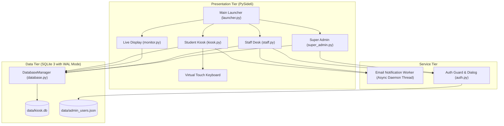

# TapNQue Queue Management System
## Comprehensive System Review, Technical Audit, and Operations Manual

---

## Executive Summary

**TapNQue** (also referenced as the *Student Kiosk Ticketing System*) is an on-premise desktop queue management solution tailored for educational institutions, specifically configured for Our Lady of Fatima University (**OLFU**). Built with **Python** and **PySide6 (Qt for Python)**, the system coordinates student registration, waiting room visualization, service counter management, and supervisory operational analytics over a local SQLite database.

---

## 1. High-Level Explanation (User & Operational Perspective)

### 1.1 Problem Space
On university campuses, administrative departments (Registrar, Admissions, Accounting, Student Affairs) face significant bottleneck challenges during enrollment, grade release, permit issuance, and clearance periods. Traditional paper sign-ups or uncoordinated lines lead to:
- Disorganized, crowded waiting rooms.
- High rates of skipped or missed numbers.
- Inability to prioritize vulnerable visitors (Persons with Disabilities, elderly parents, pregnant guardians).
- Zero visibility into actual staff transaction times and student wait times.

### 1.2 User-Facing Personas & Workflow

```
[Student / Visitor]
       │
       ▼
 1. Approaches Touchscreen Kiosk
    - Enters Student ID (Auto-formatted) & Name
    - Selects Purpose (Enrollment, Permit, Grades, Clearance)
    - Declares Visitor Status (Student, Parent, Guardian, PWD)
    - Receives Ticket # on screen + Instant Email Confirmation
       │
       ▼
 2. Waiting Area Monitor
    - Watches large TV displaying "Now Serving" Ticket # and Counter #
    - Reviews upcoming queue (Up Next 1-6) and estimated wait times
    - Receives sound chime and status email when ticket is called
       │
       ▼
 3. Service Counter Staff
    - Logs into Staff Desk on their terminal
    - Clicks "Call Next" -> Monitor updates, student alerted
    - Conducts student transaction -> Clicks "Mark as Done"
    - Can "Recall" absent students or view recent transaction history
       │
       ▼
 4. Department Supervisor (Super Admin)
    - Monitors queue health ("Stable", "Moderate", "High Load")
    - Reviews average wait times and completed transactions
    - Exports audit records to JSON
    - Configures kiosk features (e.g., enable/disable phone number field)
```

---

## 2. Low-Level Explanation (Technical Architecture & Implementation)

### 2.1 Technology Stack
- **Runtime**: Python 3.8+ (PEP 518/621 package layout).
- **GUI Framework**: PySide6 (`QtWidgets`, `QtGui`, `QtCore`, `QtMultimedia`).
- **Database Engine**: Embedded SQLite 3 (`kiosk.db`) using **WAL (Write-Ahead Logging)** mode.
- **Security & Cryptography**: Salted SHA-256 with CSPRNG hex salt (`secrets.token_hex(16)`) and constant-time digest verification (`hmac.compare_digest`).
- **Networking & Messaging**: Python `smtplib` over TLS (port 587) with non-blocking daemon threading.
- **Asset Subsystem**: Dynamic multi-tier resolver supporting `assets/images/`, `assets/audio/`, and fallback project root paths.

### 2.2 Component Hierarchy & Data Flow



### 2.3 Database Schema & Relational Design

#### Table: `tickets`
| Column | Type | Constraints | Description |
| :--- | :--- | :--- | :--- |
| `ticket_number` | INTEGER | PRIMARY KEY | Sequential ticket identifier (1, 2, 3...) |
| `name` | TEXT | NOT NULL | Student or visitor full name |
| `student_id` | TEXT | NOT NULL | Matriculation number (e.g., `2023-00001`) |
| `email` | TEXT | NULLABLE | Student email for receipt and calling alert |
| `phone` | TEXT | NULLABLE | Contact telephone |
| `visitor_type` | TEXT | DEFAULT 'Student' | Student, Parent, Guardian, or PWD |
| `purpose` | TEXT | NOT NULL | Transaction purpose |
| `priority_type` | TEXT | DEFAULT 'Standard' | Priority weighting (`Urgent`, `High`, `Standard`) |
| `created_at` | TEXT | NOT NULL | ISO 8601 registration timestamp |
| `called_at` | TEXT | NULLABLE | Timestamp when staff clicked "Call Next" |
| `recalled_at` | TEXT | NULLABLE | Timestamp of recall attempts |
| `completed_at` | TEXT | NULLABLE | Timestamp when marked "Done" |
| `status` | TEXT | DEFAULT 'waiting' | `waiting`, `serving`, `recalled`, `completed` |
| `counter_id` | INTEGER | NULLABLE | Foreign reference to `counters.id` |
| `wait_time` | REAL | NULLABLE | Total wait duration in seconds |
| `prioritized_at`| TEXT | NULLABLE | Timestamp of priority escalation |

#### Table: `counters`
| Column | Type | Constraints | Description |
| :--- | :--- | :--- | :--- |
| `id` | INTEGER | PRIMARY KEY | Counter station number (1, 2, 3) |
| `name` | TEXT | NOT NULL | Descriptive name ("Counter 1") |
| `status` | TEXT | DEFAULT 'available' | `available` or `busy` |
| `current_ticket`| INTEGER | NULLABLE | Current active ticket being served |

#### Table: `statistics` & `settings`
- `statistics`: Key-value real-number table storing `total_served`, `total_wait_time`, and `average_wait_time`.
- `settings`: Key-value text table storing UI toggles like `phone_number_enabled`.

---

## 3. Comprehensive Project Audit

### 3.1 What the System Did Well (Strengths)

1. **Custom Touchscreen Experience**:
   - Includes a self-contained virtual QWERTY keyboard and numeric keypad specifically built for touchscreen kiosks without physical keyboards.
   - Built-in live masking and formatting for Student IDs (`YYYY-NNNNN`).
2. **Visual Polish & Styling**:
   - Modern QSS styling with dark and light themes, gradient hero cards, smooth font typography, and branded OLFU university imagery.
   - Hand-crafted Qt animations: rotating arc spinners (`AnimatedSpinner`), moving neon progress lines (`AnimatedLoadingBar`), and dynamic equalizer waves (`WaitingSignalAnimation`).
3. **Queue Prioritization Algorithms**:
   - Explicit prioritization rules allowing PWD, parents, and urgent cases to leap ahead of general student queues without altering sequential numbering.
4. **Security Awareness**:
   - Passwords were not stored in plain text; salted SHA-256 hashes with random salts and timing-attack-resistant comparisons (`hmac.compare_digest`) were employed.
5. **Multi-Window Modular Topology**:
   - Each module can be launched as an independent process on dedicated hardware (e.g., Kiosk on an iPad/touchscreen terminal, Live Monitor on an HDMI TV, Staff Desk on counter PCs).

---

### 3.2 What Was Wrong & How It Was Fixed (Audit Findings & Remediation)

| Issue # | Severity | Defect / Vulnerability | Root Cause | Remediation Applied |
| :---: | :---: | :--- | :--- | :--- |
| **SEC-01** | **CRITICAL** | **Hardcoded Plaintext Email Credentials** | In `email_sender2.py`, live Gmail address and Google App Password (`covy fvku bxst ozpr`) were hardcoded as fallbacks in source code. | Removed all plaintext secrets from code. Replaced with environment variable resolution (`TAPNQUE_SENDER_EMAIL`, `TAPNQUE_SENDER_PASSWORD`) and documented in `.env.example`. |
| **PERF-01** | **HIGH** | **GUI Freezing on Network Operations** | Synchronous SMTP calls executed directly on the Qt Main Thread during button clicks (`_submit_ticket`, `_call_next`, `_mark_done`). Any network latency froze the UI. | Implemented `send_email_async()` using background daemon threads (`threading.Thread`). The UI remains completely fluid regardless of network state. |
| **DATA-01** | **HIGH** | **Database Concurrency & Locking** | SQLite defaults to rollback journals without timeout protection. Simultaneous writes from Kiosk + Staff + Super Admin could throw `sqlite3.OperationalError: database is locked`. | Enabled `PRAGMA journal_mode = WAL` (Write-Ahead Logging) and `PRAGMA busy_timeout = 5000` on all connections. |
| **BUG-01** | **HIGH** | **"Clear Completed" Ghost Implementation** | `_clear_completed` in `super_admin.py` showed a confirmation dialog saying "Completed tickets cleared!", but executed **zero SQL commands**. | Implemented `clear_completed_tickets() -> int` in `DatabaseManager` and wired it to `SuperAdmin._clear_completed()`. |
| **BUG-02** | **MEDIUM** | **Dead Code: Unwired Export Feature** | `SuperAdmin._export_stats` was fully written, but had no button in the UI layout to invoke it. | Added an `EXPORT DATA` button to the Queue tab action bar wired directly to `_export_stats()`. |
| **UI-01** | **MEDIUM** | **Hardcoded Counter Station** | `StaffAdmin` hardcoded `SERVICE_COUNTER_ID = 1`. If two staff opened the app, both operated on Counter 1. | Added dynamic Counter Station selection (`Counter 1`, `Counter 2`, `Counter 3`) to the Staff Admin header and initialization parameters. |
| **STR-01** | **MEDIUM** | **Disorganized Flat Root Directory** | Raw images (`.jpg`, `.png`), database files (`.db`, `.json`), zip files (`tapnque.zip`), and python scripts were all dumped in root. | Refactored into standard modern Python structure (`src/tapnque/`, `assets/`, `data/`, `docs/`, `tests/`, `backups/`). |
| **PATH-01** | **MEDIUM** | **Fragile Path Traversal** | Absolute and relative paths (`Path(__file__).parent / "filename"`) were hardcoded across 10 files. | Created centralized `config.py` with multi-tier `get_asset_path()` resolver. |

---

## 4. Modern Directory Structure

The repository has been restructured according to **PEP 518 / PEP 621** standards:

```
Project6/
├── assets/
│   ├── audio/
│   │   └── NOTIFY_SOUND.md          # Specification for chime audio
│   └── images/
│       ├── Background Olfu bw.jpg   # Monochrome background artwork
│       ├── Background Olfu.jpg      # Full color background artwork
│       ├── OLFU LOGO 1.jpg          # University insignia 1 (JPG)
│       ├── OLFU LOGO 1.png          # University insignia 1 (PNG)
│       └── OLFU LOGO 2.png          # University insignia 2 (PNG)
├── backups/
│   └── tapnque.zip                  # Archived legacy snapshot
├── data/
│   ├── admin_users.json             # Salted SHA-256 hashed credentials
│   ├── kiosk.db                     # SQLite production database (WAL)
│   └── queue_db.json                # Legacy JSON storage
├── docs/
│   └── PROJECT_AUDIT_AND_REVIEW.md  # Complete review artifact
├── src/
│   └── tapnque/
│       ├── __init__.py
│       ├── __main__.py              # python -m tapnque entrypoint
│       ├── config.py                # Environment & dynamic path resolution
│       ├── core/
│       │   ├── __init__.py
│       │   ├── auth.py              # Cryptographic auth & login dialog
│       │   └── database.py          # SQLite engine with WAL mode
│       ├── services/
│       │   ├── __init__.py
│       │   └── email_service.py     # Asynchronous non-blocking email worker
│       ├── ui/
│       │   ├── __init__.py
│       │   ├── launcher.py          # Unified station launcher
│       │   ├── kiosk.py             # Student registration station
│       │   ├── monitor.py           # TV-friendly live queue monitor
│       │   ├── live_display.py      # Classic audio-enabled display
│       │   ├── staff.py             # Counter service desk
│       │   ├── super_admin.py       # Operational analytics dashboard
│       │   └── components/
│       │       ├── __init__.py
│       │       ├── animations.py    # Custom QPainter animations
│       │       ├── dialogs.py       # TicketCreatedDialog & HistoryDialog
│       │       └── keyboard.py      # Touchscreen virtual keyboard
│       └── cli/
│           ├── __init__.py
│           └── set_admin_password.py# Administrative password tool
├── tests/
│   ├── __init__.py
│   ├── test_auth.py                 # Unit tests for hashing & auth
│   └── test_database.py             # Unit tests for database & queues
├── main.py                          # Root launcher entry point
├── run_kiosk.py                     # Direct kiosk runner
├── run_monitor.py                   # Direct monitor runner
├── run_staff.py                     # Direct staff desk runner
├── run_admin.py                     # Direct super admin runner
├── pyproject.toml                   # Modern build system & metadata
├── requirements.txt                 # Core dependencies
├── requirements-dev.txt             # Testing & linting tools
├── .env.example                     # Configuration template
├── .gitignore                       # Clean Git exclusion rules
└── README.md                        # Project documentation
```

---

## 5. Local Machine Setup & Execution Guide

### 5.1 System Prerequisites
- **Operating System**: Linux (Ubuntu 20.04+, Debian 11+, Arch, Fedora), macOS (12+), or Windows 10/11.
- **Python**: Python 3.8 to 3.12 (recommended).
- **Display**: Any 1080p or 720p monitor (supports touchscreens and TV HDMI output).

---

### 5.2 Step-by-Step Installation

#### Step 1: Clone or Navigate to Directory
```bash
cd /path/to/Project6
```

#### Step 2: Create and Activate a Python Virtual Environment
**On Linux / macOS:**
```bash
python3 -m venv .venv
source .venv/bin/activate
```

**On Windows (Command Prompt):**
```cmd
python -m venv .venv
.venv\Scripts\activate.bat
```

**On Windows (PowerShell):**
```powershell
python -m venv .venv
.venv\Scripts\Activate.ps1
```

#### Step 3: Install Required Dependencies
```bash
pip install --upgrade pip
pip install -r requirements.txt
```

---

### 5.3 Configuring Environment Variables (Optional)

If email receipts are desired, copy `.env.example` to `.env`:
```bash
cp .env.example .env
```
Edit `.env` with your SMTP sender details:
```ini
TAPNQUE_SMTP_SERVER=smtp.gmail.com
TAPNQUE_SMTP_PORT=587
TAPNQUE_SENDER_EMAIL=your_office_email@gmail.com
TAPNQUE_SENDER_PASSWORD=your_gmail_app_password
```
*(If omitted, TapNQue runs in offline mode without attempting network connections).*

---

### 5.4 Running the Application

#### Mode 1: Unified Hub (Easiest for single-machine testing)
```bash
python main.py
```
This opens the central menu from which you can launch the Kiosk, Live Monitor, Staff Desk, and Super Admin in separate windows.

#### Mode 2: Station-Specific Execution (For multi-terminal deployments)
In production, each physical terminal runs its dedicated station:

1. **Touchscreen Kiosk (Self-service terminal for students)**:
   ```bash
   python run_kiosk.py
   ```
   *Controls: Starts in fullscreen splash; press Esc to exit fullscreen.*

2. **Waiting Room Live Display (Connected to TV screen)**:
   ```bash
   python run_monitor.py
   ```
   *Controls: Press `F11` to toggle Fullscreen; press `Esc` to restore window.*

3. **Service Counter Staff Terminal (Counter staff PC)**:
   ```bash
   python run_staff.py
   ```
   *Default Login: username `staff`, password `staff123`.*

4. **Super Admin Dashboard (Supervisor PC)**:
   ```bash
   python run_admin.py
   ```
   *Default Login: username `admin`, password `admin123`.*

---

### 5.5 Updating Administrator Credentials

To change staff or super admin credentials securely via CLI:
```bash
# Update Staff credentials
python -m tapnque.cli.set_admin_password staff counter_staff_01 SecretPass456!

# Update Super Admin credentials
python -m tapnque.cli.set_admin_password super_admin head_registrar SuperAdmin2026!
```

---

### 5.6 Running the Automated Test Suite

TapNQue includes an isolated unit test suite covering database transactions, FIFO ordering, priority queues, counter transitions, statistics aggregation, and cryptographic authentication.

Run the test suite with:
```bash
PYTHONPATH=src python3 -m unittest discover tests -v
```

Expected output:
```text
test_authentication_success_and_failure (test_auth.TestAuth) ... ok
test_build_user_salting (test_auth.TestAuth) ... ok
test_default_auth_file_generation (test_auth.TestAuth) ... ok
test_call_and_complete_lifecycle (test_database.TestDatabaseManager) ... ok
test_clear_completed_tickets (test_database.TestDatabaseManager) ... ok
test_create_ticket_sequential_numbering (test_database.TestDatabaseManager) ... ok
test_initialization (test_database.TestDatabaseManager) ... ok
test_queue_priority_ordering (test_database.TestDatabaseManager) ... ok
test_settings_toggle (test_database.TestDatabaseManager) ... ok

----------------------------------------------------------------------
Ran 9 tests in 0.020s

OK
```

---

## 6. Maintenance & Operational Recommendations

1. **Database Backups**:
   - Schedule a nightly backup of `data/kiosk.db`. Since SQLite WAL mode is enabled, backups can be taken while the system is running using the SQLite `.backup` command or by copying `kiosk.db` along with `kiosk.db-wal`.
2. **End-of-Day Archival**:
   - Supervisors can use the **EXPORT DATA** button in the Super Admin Console to archive completed transactions to JSON, followed by **CLEAR COMPLETED** to keep the active queue table compact.
3. **Sound Chime File**:
   - To enable the audible chime on ticket calls, place a 1-second WAV audio clip named `notify.wav` into the `assets/audio/` directory.
