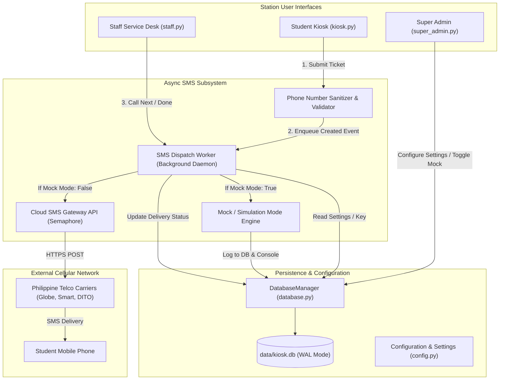
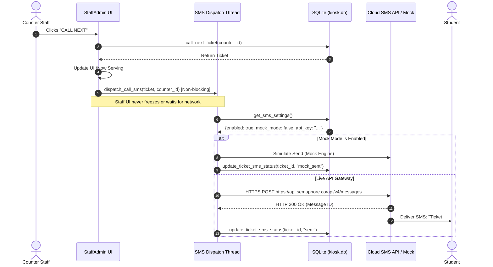

# TapNQue - Pure Software SMS Integration Plan
## Tier 2: Standard Capstone Package (Option B)

**Document Version:** 1.0  
**Status:** Approved by Client / Ready for Implementation  
**Target Milestone:** 4 to 6 Business Days  
**Scope Alignment:** Tier 2 (Option B – Standard Capstone Package, PHP 5,000.00)  
**Target Platform:** Python 3.8+ / PySide6 (Qt) / SQLite 3 (WAL Mode)  

---

## 1. Executive Summary & Scope Definition

The client has officially selected **Option B (Tier 2 – Standard Capstone Package)** for integrating a **Pure Software SMS Notification System** into the **TapNQue** Queue Management System.

This plan details the technical architecture, database migrations, module-by-module implementation tasks, testing procedures, and defense demonstration strategy. The implementation preserves the existing modular architecture, adheres to PEP 518/621 standards, and guarantees that network calls never degrade or freeze the PySide6 user interface.

### 1.1 In-Scope Deliverables (Tier 2)

| Deliverable | Description | Key Modules Affected |
| :--- | :--- | :--- |
| **Cloud SMS Gateway Client** | REST client for the Semaphore SMS gateway (tested, supported provider; endpoint URL configurable; other providers require a small payload adapter). | `src/tapnque/services/sms_service.py` |
| **Non-Blocking Async Dispatch** | Background worker thread pool ensuring zero UI stutters or ANR (Application Not Responding) events. | `src/tapnque/services/sms_service.py` |
| **Kiosk Ticket Registration SMS** | Automated SMS sent to students upon obtaining a ticket (includes ticket number, queue position, purpose). | `src/tapnque/ui/kiosk.py` |
| **Counter "Call Next" Alert SMS** | Automated SMS sent when counter staff calls a ticket (includes counter number and reporting instructions). | `src/tapnque/ui/staff.py` |
| **Ticket Served Confirmation SMS** | Automated SMS confirming completion of service transaction. | `src/tapnque/ui/staff.py` |
| **Phone Number Sanitization & Validation** | Automated cleaner and validator for Philippine mobile prefixes (`09XX...`, `+639...`). | `src/tapnque/services/sms_service.py` |
| **Dedicated Mock / Simulation Mode** | Built-in offline testing mode for rehearsals and defense rooms with poor signal or zero credits. | `src/tapnque/services/sms_service.py` |
| **Super Admin GUI Controls** | Settings tab controls: SMS ON/OFF toggle, Mock Mode toggle, API Key entry, and template editors. | `src/tapnque/ui/super_admin.py` |
| **SQLite Delivery Tracking** | Persistent database columns tracking SMS dispatch status per ticket. | `src/tapnque/core/database.py` |
| **Unit Test Suite** | Automated unit tests covering phone formatting, queue workers, mock dispatch, and API fallback. | `tests/test_sms.py` |

---

## 2. System Architecture & Data Flow

### 2.1 Component Interaction Diagram



### 2.2 Sequence of Events: Ticket Call Lifecycle



---

## 3. Database Schema Migration Plan

The existing database schema in [`kiosk.db`](file:///home/javvii/FreelanceProject/Project6/data/kiosk.db) uses SQLite WAL mode. We will apply an idempotent, non-destructive migration that adds tracking columns to `tickets` and default settings to `settings`.

### 3.1 `tickets` Table Alterations
The following columns will be added to the `tickets` table:

```sql
-- Migration statement: executed safely via DatabaseManager._initialize_db()
ALTER TABLE tickets ADD COLUMN phone_formatted TEXT;
ALTER TABLE tickets ADD COLUMN sms_ticket_status TEXT DEFAULT 'pending';
ALTER TABLE tickets ADD COLUMN sms_called_status TEXT DEFAULT 'pending';
ALTER TABLE tickets ADD COLUMN sms_completed_status TEXT DEFAULT 'pending';
ALTER TABLE tickets ADD COLUMN sms_last_error TEXT;
```

**Status Enumerations:**
- `'pending'`: Ticket created, SMS not yet dispatched or phone number was empty.
- `'sent'`: Message successfully handed off to external cloud SMS API.
- `'mock_sent'`: Message intercepted by Mock Mode for defense/testing without credit usage.
- `'failed'`: Gateway returned error (e.g., invalid phone number or out of credits).
- `'disabled'`: SMS system was toggled OFF in settings during the event.

### 3.2 `settings` Table Additions
The `settings` key-value table will be populated with default configuration keys:

| Setting Key | Default Value | Description |
| :--- | :--- | :--- |
| `sms_enabled` | `"1"` | Master toggle to enable/disable SMS notifications. |
| `sms_mock_mode` | `"1"` | Defense safe mode (`1` = Mock, `0` = Real Cloud API). |
| `sms_completed_enabled` | `"1"` | Per-event toggle for the optional Ticket Completed / Served confirmation SMS. |
| `sms_api_key` | `""` | Gateway API key (Semaphore). |
| `sms_sender_name` | `"TapNQue"` | Registered SMS sender ID (defaults to Semaphore's standard). |
| `sms_template_created` | `"Hello {name}! Ticket #{ticket} is confirmed. Line position: {position}. Purpose: {purpose}. - TapNQue"` | Template for registration. |
| `sms_template_called` | `"ALERT: Ticket #{ticket} ({name}) is NOW BEING CALLED at Counter {counter}. Please proceed immediately. - TapNQue"` | Template when called. |
| `sms_template_completed` | `"Ticket #{ticket} completed. Thank you for visiting! - TapNQue"` | Template when finished. |

---

## 4. Module-by-Module Technical Specification

### 4.1 Module: `src/tapnque/services/sms_service.py` (New Core Service)

This module handles sanitization, gateway communications, mock emulation, and asynchronous background queuing.

#### Key Functions & Classes:

1. **`sanitize_ph_phone_number(raw_phone: str) -> Optional[str]`**
   - Strips whitespace, dashes, parentheses (`0917-123-4567` $\to$ `09171234567`).
   - Converts international format `+639171234567` or `639171234567` $\to$ `09171234567`.
   - Validates that the number starts with `09` and has exactly 11 digits. Returns `None` if invalid.

2. **`format_sms_template(template: str, context: dict) -> str`** *(shipped name; planned as `format_template`)*
   - Safe interpolation for `{name}`, `{ticket}`, `{position}`, `{purpose}`, `{counter}`.
   - Unknown or malformed placeholders pass through literally — no `str.format` crash risk.

3. **`class _SMSQueueManager`** *(shipped name; planned as `SMSDispatchWorker`)*
   - Singleton background daemon thread using a bounded `queue.Queue` (max 500 pending dispatches; overflow is dropped and logged).
   - Worker thread starts lazily on the first dispatch — importing the module never spawns threads.
   - Survives unhandled task exceptions and keeps processing the queue.
   - Prevents blocking the PySide6 UI event loop.

4. **`send_ticket_created_sms` / `send_ticket_called_sms` / `send_ticket_completed_sms`** *(shipped trigger API; planned as a single `send_sms_async(phone, message, event_type, ticket_number)`)*
   - Each validates and sanitizes the recipient, interpolates the configured template, and enqueues the payload for background dispatch via `_SMSQueueManager.enqueue()`.
   - `send_ticket_completed_sms` additionally honors the `sms_completed_enabled` per-event toggle.
   - Checks `sms_mock_mode`:
     - If **Mock Mode = True**: Writes a mock log entry, prints simulation notice to terminal, updates DB status to `'mock_sent'`.
     - If **Mock Mode = False**: Executes `urllib.request` HTTPS POST to Semaphore API:
       ```json
       POST https://api.semaphore.co/api/v4/messages
       {
         "apikey": "<CONFIGURED_API_KEY>",
         "number": "09171234567",
         "message": "...",
         "sendername": "TapNQue"
       }
       ```
     - Updates SQLite database with result status (`'sent'` or `'failed'`).

---

### 4.2 Module: `src/tapnque/core/database.py` (Persistence Enhancements)

New methods to add to [`DatabaseManager`](file:///home/javvii/FreelanceProject/Project6/src/tapnque/core/database.py):

1. **`get_sms_settings() -> Dict[str, Any]`**
   - Returns dictionary of all SMS configuration keys with typed fallbacks (`bool`, `str`).
2. **`update_sms_settings(settings: Dict[str, Any])`**
   - Atomically updates SMS settings keys in the `settings` table.
3. **`update_ticket_sms_status(ticket_number: int, event_type: str, status: str, error_msg: Optional[str] = None)`**
   - Updates `sms_ticket_status`, `sms_called_status`, or `sms_completed_status` for the given ticket.
4. **`get_ticket_sms_status(ticket_number: int) -> Dict[str, str]`**
   - Retrieves delivery status flags for UI badges or history inspection.

---

### 4.3 Module: `src/tapnque/ui/kiosk.py` (Student Check-In Station)

#### Modifications:
- In `_submit_ticket()`:
  - If phone number is enabled and provided, validate via `sanitize_ph_phone_number()`.
  - If invalid, display a friendly validation warning:  
    `"Please enter a valid 11-digit Philippine mobile number (e.g. 0917 123 4567)."`
  - On successful ticket creation, trigger `send_ticket_created_sms(ticket, queue_position)`.
  - Update [`TicketCreatedDialog`](file:///home/javvii/FreelanceProject/Project6/src/tapnque/ui/components/dialogs.py#L30-L240) to reflect SMS status:
    `"Digital ticket details sent to your mobile phone via SMS."`

---

### 4.4 Module: `src/tapnque/ui/staff.py` (Counter Service Desk)

#### Modifications:
- In `_call_next()`:
  - Extract phone number of called ticket.
  - Trigger `send_ticket_called_sms(ticket, service_counter_id)`.
- In `_recall_ticket()`:
  - Trigger `send_ticket_called_sms(active_ticket, service_counter_id)` (recall notice).
- In `_mark_done()`:
  - Trigger `send_ticket_completed_sms(active_ticket)` (service thank-you note; skipped when the `sms_completed_enabled` toggle is OFF).

---

### 4.5 Module: `src/tapnque/ui/super_admin.py` (Super Admin Console)

#### Enhancements to `_build_settings_tab()`:
Add an **SMS Gateway Management Section** containing:
1. **Master SMS Toggle**: Push button to turn SMS service ON or OFF.
2. **Mock / Simulation Mode Toggle**: Push button with distinct green/yellow status badge:
   - *Status*: `"[MOCK MODE ACTIVE] SMS alerts are simulated locally (Safe for rehearsals and defense)."`
   - *Button*: `"SWITCH TO LIVE GATEWAY"` / `"SWITCH TO MOCK MODE"`
3. **API Key Input Field**: Password-masked text input to enter the Semaphore API key directly in the GUI without editing `.env` or code.
4. **Sender Name Field**: Editable text field (e.g., `TapNQue` or `SEMAPHORE`).
5. **Template Customization Box**: Text areas to inspect and customize the message templates for Created, Called, and Completed events.

---

## 5. Mock / Simulation Mode: Defense Safety Net

### 5.1 Why Mock Mode is Essential for 4th-Year Capstone
In university thesis defenses, panels frequently test corner cases, but students face serious external failure points:
- The defense room may be located in a campus basement or interior hall with zero cellular data reception.
- The university Wi-Fi network frequently blocks outbound SMTP or API ports.
- Prepaid API credits can run out in the middle of repeated panel tests.

### 5.2 How Mock Mode Works
```
[Ticket Created / Called]
          │
          ▼
Is Mock Mode Active? (Checked from SQLite settings)
     ├── YES ──► Intercept outgoing payload
     │           Print formatted terminal toast:
     │           [MOCK SMS] To: 09171234567 | Msg: "Ticket #0005 called at Counter 1"
     │           Update SQLite status: sms_called_status = "mock_sent"
     │           Display visual green toast badge in GUI: "SMS Simulated (Mock Mode)"
     │           Cost: PHP 0.00 (Zero credits consumed, zero internet required)
     │
     └── NO  ──► Send live HTTPS POST to cloud gateway API
                 Deliver actual SMS to student handset
                 Update SQLite status: sms_called_status = "sent"
```

---

## 6. Step-by-Step Implementation Roadmap

```
  Day 1: Foundation & Service Tier
  ├── Step 1.1: Database Schema Migration in database.py
  ├── Step 1.2: Configuration variables in config.py
  └── Step 1.3: Core SMS client & async worker in sms_service.py

  Day 2: Validation & Mock Engine
  ├── Step 2.1: Philippine phone number regex validator & normalizer
  ├── Step 2.2: Mock / Simulation dispatch engine
  └── Step 2.3: Unit test suite in tests/test_sms.py (TDD verification)

  Day 3: Station UI Integrations
  ├── Step 3.1: Student Kiosk check-in trigger & validation dialog
  ├── Step 3.2: Staff Admin "Call Next", "Recall", "Done" triggers
  └── Step 3.3: Integration tests across stations

  Day 4: Super Admin GUI Settings
  ├── Step 4.1: Settings tab SMS group in super_admin.py
  ├── Step 4.2: Master ON/OFF toggle & Mock Mode switch
  └── Step 4.3: API key management & template customizer

  Day 5: Verification & Capstone Demonstration Pack
  ├── Step 5.1: Real carrier end-to-end tests (Globe / Smart / DITO)
  ├── Step 5.2: Defense demo cheat-sheet & presentation walkthrough
  └── Step 5.3: Final acceptance & delivery packaging
```

---

## 7. Testing, Verification & Quality Assurance

### 7.1 Automated Unit Tests (`tests/test_sms.py`)
A dedicated automated test suite will test:
1. `test_phone_sanitization`: Tests valid formats (`09171234567`, `+639171234567`, `0917-123-4567`) and rejects invalid numbers (`0812...`, `12345`, text).
2. `test_template_interpolation`: Verifies correct variable replacement for `{ticket}`, `{name}`, `{counter}`, and `{purpose}`.
3. `test_mock_dispatch_logging`: Confirms that in mock mode, SQLite status updates to `'mock_sent'` without initiating network sockets.
4. `test_async_queue_non_blocking`: Confirms that `send_sms_async` returns in under 5 milliseconds regardless of simulated network delay.
5. `test_settings_persistence`: Verifies that toggling Mock Mode and editing API keys via `DatabaseManager` persists across app restarts.

### 7.2 Manual Acceptance Criteria (Client Sign-Off Checklist)
- [ ] Student registers at Kiosk $\to$ Real phone receives SMS within 5 seconds.
- [ ] Counter staff clicks "Call Next" $\to$ Real phone receives counter alert within 5 seconds.
- [ ] Counter staff clicks "Mark Done" $\to$ Real phone receives completion note.
- [ ] Disconnecting internet while Mock Mode is ON $\to$ System continues running flawlessly without crashes or error popups.
- [ ] Super Admin changes API key or toggles SMS OFF $\to$ Kiosk and Staff immediately respect the new settings.

---

## 8. Defense Presentation Guide for Students

> **Scope note:** This section is provided as a goodwill extra. Per the project quotation, an
> "Oral Defense Preparation Guide" is a Tier 3 (Option C) deliverable; it is shown here for
> planning completeness and is not part of the billed Tier 2 (Option B) scope.

To ensure the 4th-year students ace their capstone defense, the delivery package includes standard answers to common panel questions:

### Expected Defense Questions & Model Answers

**Panel Question 1:** *"Why did you use a software API instead of an Arduino GSM Shield (SIM900/SIM800L)?"*  
> **Student Answer:** *"GSM shields introduce physical hardware bottlenecks—they require serial COM port synchronization, can only send one message sequentially at a time, suffer from antenna attenuation indoors, and risk hardware failure. By implementing an asynchronous cloud SMS gateway architecture, our system sends messages concurrently in the background, scales to hundreds of simultaneous users, and maintains a clean, modern software-only deployment."*

**Panel Question 2:** *"What happens if the university internet connection drops during registration?"*  
> **Student Answer:** *"The SMS subsystem runs on non-blocking daemon threads separated from the main PySide6 UI. If network latency or disconnection occurs, the student kiosk and staff desk never freeze. The transaction is safely committed to the local SQLite database, and the error status is recorded in the ticket log for audit."*

**Panel Question 3:** *"How do you test this without consuming school or personal funds for SMS credits?"*  
> **Student Answer:** *"We built an administrative Mock Simulation Mode directly into the Super Admin settings. In Mock Mode, the complete queue flow is demonstrated with zero telecom cost, while real API dispatch can be toggled on with a single switch for live deployment."*

---

## 9. Rollback & Contingency Strategy

1. **Independent Service Module**: All SMS logic is isolated inside `src/tapnque/services/sms_service.py`. The existing email notifications, local queue logic, and display monitor remain completely decoupled.
2. **One-Click Disable**: If any external provider has an outage on defense day, switching the Super Admin toggle to `SMS: OFF` or `Mock Mode: ON` immediately restores 100% offline functionality.
3. **Preserved Backup**: The pre-SMS version snapshot is preserved in [`backups/tapnque.zip`](file:///home/javvii/FreelanceProject/Project6/backups/tapnque.zip).
