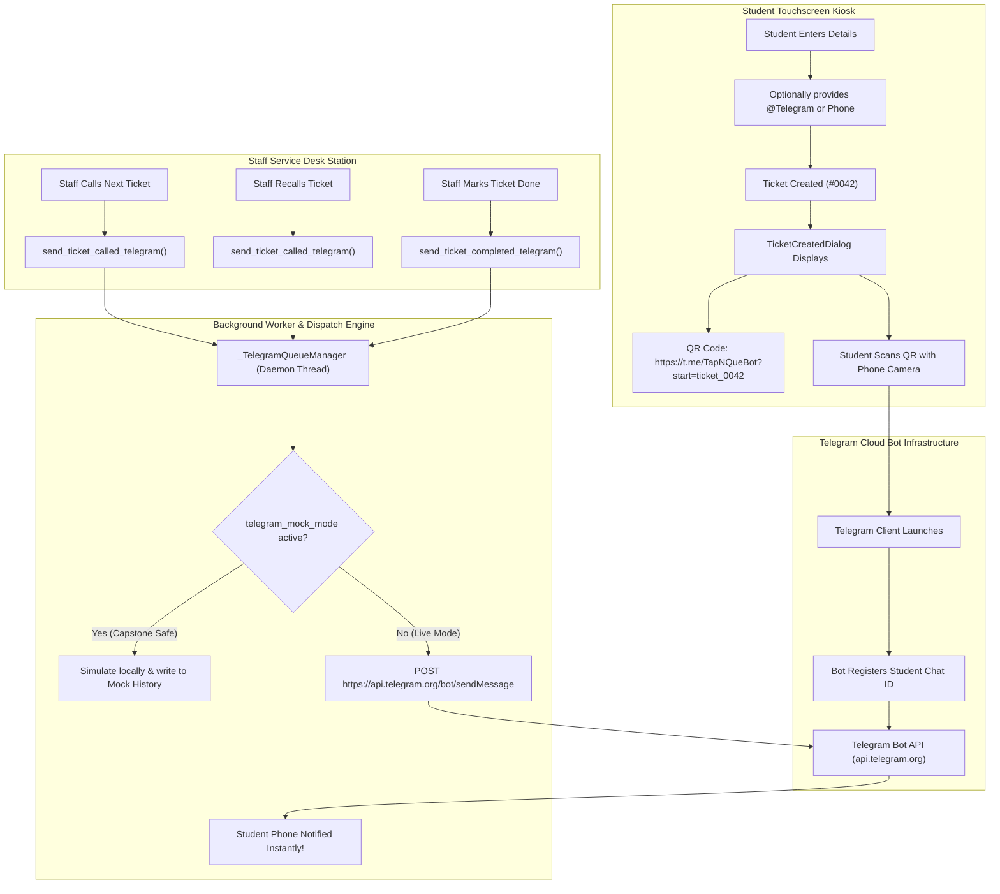

# 11-09-2026 — TapNQue Telegram QR Bot API Integration & Operations Manual

---

## 1. Executive Summary

This engineering document details the implementation and operational architecture of the **TapNQue Telegram QR Bot Notification Subsystem** in **Project6.1** (`telegram-version` branch). 

As researched in [`11-09-2026_FREE_SMS_ALTERNATIVES_RESEARCH.md`](11-09-2026_FREE_SMS_ALTERNATIVES_RESEARCH.md), conventional SMS gateways (Semaphore, PhilSMS) incur recurring credit expenses per dispatch and depend heavily on telecom carrier routing. To provide an enterprise-grade, **completely free ($0.00/month)**, zero-quota notification alternative for university students, TapNQue introduces direct push alerts via the **official Telegram Bot API (`api.telegram.org`)** combined with **client-side QR code deep-linking**.

---

## 2. Strategic Advantages of Telegram Bot vs. Traditional SMS

| Strategic Vector | Traditional SMS (Semaphore / PhilSMS) | TapNQue Telegram Bot API |
| :--- | :--- | :--- |
| **Direct Expense** | ₱0.40 – ₱0.50 per 160-character segment | **₱0.00 (100% Free & Unlimited)** |
| **Prepaid Expiry** | Credits expire after 1–2 years | **No expiration; No credit account needed** |
| **Character Limits** | 160 GSM-7 / 70 Unicode chars per segment | **Up to 4,096 UTF-8 characters per message** |
| **Formatting** | Plain text only | **Markdown formatting (bold, italics, code, links)** |
| **Onboarding** | Requires typing Philippine mobile number | **Instant camera QR scan via smartphone** |
| **Delivery Speed** | 3 – 45 seconds (subject to Telco congestion) | **Sub-second direct cloud socket push** |
| **Privacy / Spam** | Telcos mandate DNC filtering & KYC registration | **Direct end-to-end encrypted bot session** |

---

## 3. System Architecture & Workflow



---

## 4. Deep-Linking QR Code Mechanics

To eliminate friction where a student must manually search for the bot or look up their numeric Telegram Chat ID, TapNQue employs **Telegram Bot Deep Linking**:

1. **Format**:
   $$\text{https://t.me/}\langle\text{bot\_username}\rangle\text{?start=ticket\_}\langle\text{ticket\_number}\rangle$$
   *Example*: `https://t.me/TapNQueBot?start=ticket_0042`
2. **QR Code Generation**:
   The kiosk renders an on-screen vector/raster QR code using `qrcode` with high-contrast emerald/navy branding (`#102a43` on `#ffffff`) scaled smoothly for kiosk displays.
3. **Student Experience**:
   Scanning the QR code opens the Telegram application directly to `@TapNQueBot` with the ticket parameter pre-staged in the `/start` payload.

---

## 5. Setting Up a Live Telegram Bot (BotFather Guide)

Setting up an official Telegram Bot requires zero credit cards or billing credentials:

1. Open Telegram and search for `@BotFather` (verified blue checkmark).
2. Send the command:
   ```text
   /newbot
   ```
3. Follow the prompts:
   - **Name**: `TapNQue Queue Alert Bot`
   - **Username**: Must end with `bot` (e.g., `TapNQueQueueBot` or `OlfuTapNQueBot`).
4. `@BotFather` responds with your **HTTP API Token**:
   ```text
   Use this token to access the HTTP API:
   1234567890:ABCdefGhIJKlmNoPQRsTUVwxyZ12345
   ```
5. Copy this token into **Super Admin > Settings > Telegram QR Bot System Configuration > Telegram Bot Token**.
6. Set **Telegram Bot Username** to your bot handle (e.g. `OlfuTapNQueBot`).
7. Switch from **MOCK SIMULATION** to **LIVE BOT**.

---

## 6. Safe Capstone Mock Simulation Mode

For university capstone defenses, panel demonstrations, or environments without stable internet connections:

- **Enabled by Default**: `telegram_mock_mode = 1`.
- **Zero Configuration Required**: Does not require an active Telegram Bot Token or internet connection.
- **Audit Console Logs**:
  ```text
  ✈️ [TELEGRAM BOT SIMULATION] To: @student | Event: CALLED | Ticket: #0005
     "🔔 NOW SERVING ALERT: Ticket #0005, please proceed to Counter 1 immediately!"
  ```
- **Live GUI Inspector**: Clicking **"VIEW MOCK TELEGRAM LOGS"** in Super Admin launches an interactive table viewer showing all simulated dispatches, timestamps, event triggers, and rendered markdown text.

---

## 7. Database Schema & Persistence

The SQLite database (`kiosk.db`) automatically incorporates Telegram tracking columns in the `tickets` table and configuration parameters in the `settings` table:

### Tickets Table Extensions
```sql
ALTER TABLE tickets ADD COLUMN telegram_chat_id TEXT;
ALTER TABLE tickets ADD COLUMN telegram_ticket_status TEXT DEFAULT 'pending';
ALTER TABLE tickets ADD COLUMN telegram_called_status TEXT DEFAULT 'pending';
ALTER TABLE tickets ADD COLUMN telegram_completed_status TEXT DEFAULT 'pending';
ALTER TABLE tickets ADD COLUMN telegram_last_error TEXT;
```

### Settings Table Keys
- `telegram_enabled`: `1` (Active) or `0` (Disabled).
- `telegram_mock_mode`: `1` (Local Mock) or `0` (Live HTTP API).
- `telegram_bot_token`: API token provided by `@BotFather`.
- `telegram_bot_username`: Public username handle of the bot.
- `telegram_template_created`: Template interpolated upon kiosk ticket generation.
- `telegram_template_called`: Template interpolated upon counter staff calling/recalling ticket.
- `telegram_template_completed`: Template interpolated upon marking ticket done.

---

## 8. Dual-Directory Simultaneous Operation Guarantee

Because TapNQue computes `DATA_DIR = PROJECT_ROOT / "data"` relative to the current file location:

1. **Project6** (`/home/javvii/FreelanceProject/Project6`):
   - Branch: `philsms-version`
   - Database: `/home/javvii/FreelanceProject/Project6/data/kiosk.db`
   - Outbound Channel: PhilSMS Cloud REST API
2. **Project6.1** (`/home/javvii/FreelanceProject/Project6.1`):
   - Branch: `telegram-version`
   - Database: `/home/javvii/FreelanceProject/Project6.1/data/kiosk.db`
   - Outbound Channel: Telegram Bot API & QR Deep-Linking

Both directories share the same virtual environment (`.venv`), maintain zero port conflicts (pure desktop UI with local SQLite), and can run simultaneously on developer workstations or campus test environments without data contamination.

---

## 9. Verification & Automated Test Suite

All 31 unit tests in `Project6.1` pass with 100% success rate:

```bash
/home/javvii/FreelanceProject/Project6/.venv/bin/pytest tests/ -v
```

### Test Coverage Breakdown:
- `tests/test_telegram.py`:
  - `test_format_telegram_template`: Validates `{name}`, `{ticket}`, `{position}`, `{purpose}`, `{counter}` interpolation.
  - `test_generate_telegram_qr_pixmap`: Verifies matrix pixmap generation with offscreen Qt.
  - `test_get_telegram_bot_link`: Tests deep-linking URLs with base and ticket parameters.
  - `test_simulate_mock_telegram`: Tests in-memory log recording and clearing.
  - `test_send_via_telegram_api_missing_token`: Validates early validation guard.
  - `test_send_via_telegram_api_mocked_success`: Tests HTTP POST payload with mocked Telegram endpoint.
  - `test_high_level_triggers_no_chat_id`: Validates fallback when ticket lacks Telegram handle.
  - `test_high_level_triggers_with_chat_id`: Validates asynchronous queuing.
- `tests/test_database.py`: Tests Telegram settings retrieval, saving, toggling, and ticket Telegram status tracking.
